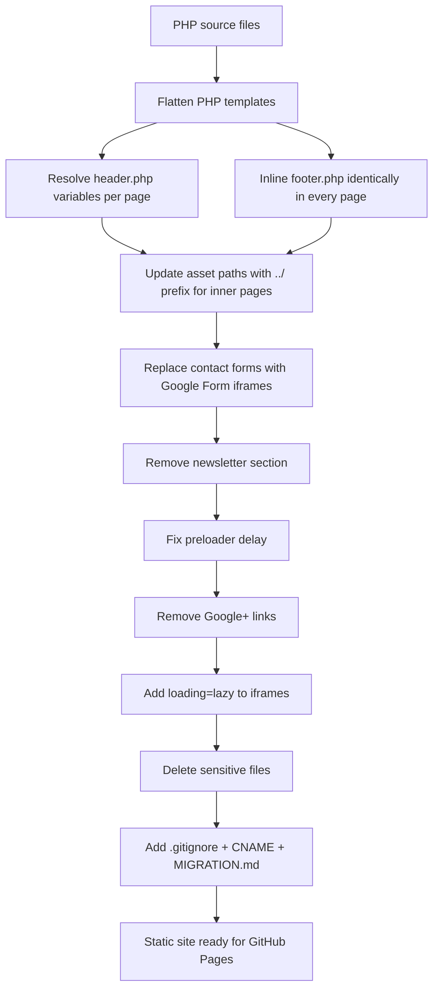

# Design Document: GitHub Pages Migration

## Overview

This document describes the technical design for converting the LIT Academy PHP website into a fully static site deployable on GitHub Pages. The migration is a pure hosting-platform change: no new features are introduced, no content is altered, and the visual appearance is preserved exactly.

The current site uses PHP server-side includes (`header.php`, `footer.php`) to share navigation and footer markup across pages, and a PHP mail handler (`contactForm.php`) for contact form submissions. GitHub Pages serves only static files, so every PHP construct must be eliminated before deployment.

The output is a repository of plain HTML, CSS, JS, and image files that GitHub Pages can serve directly, with the custom domain `lit.academy` routed via GoDaddy DNS.

---

## Architecture

### Current Architecture

```
Browser → GoDaddy DNS → Wasmer PHP Hosting
                              ↓
                    Apache/PHP runtime
                    ├── header.php  (shared include)
                    ├── footer.php  (shared include)
                    ├── index.php   (homepage)
                    ├── *.php       (inner pages)
                    └── contactForm.php (mail handler)
```

### Target Architecture

```
Browser → GoDaddy DNS → GitHub Pages CDN
                              ↓
                    Static file serving
                    ├── index.html          (homepage)
                    ├── about/index.html
                    ├── why-us/index.html
                    ├── ...
                    └── contact/index.html
```

GitHub Pages serves `{slug}/index.html` when a browser requests `/{slug}/`, providing clean URLs without `.html` extensions — no server configuration required.

### Migration Flow



---

## Components and Interfaces

### Repository Structure

```
/ (repo root)
├── index.html                    # Homepage (from index.php)
├── CNAME                         # Contains: lit.academy
├── MIGRATION.md                  # GoDaddy DNS cutover guide
├── .gitignore
├── css/
│   ├── bootstrap.min.css
│   ├── bootstrap-theme.min.css
│   ├── default.css
│   ├── nivo-slider.css
│   └── style.css
├── js/
│   ├── bootstrap.min.js
│   ├── custom.js
│   ├── jquery.matchHeight-min.js
│   ├── jquery.nivo.slider.js
│   ├── jquery.superscrollorama.js
│   ├── singlePageNav.js
│   └── greensock/
│       └── (all greensock files unchanged)
├── img/                          # All images unchanged
├── favicon/                      # All favicon files unchanged
├── about/index.html              # from aboutus.php
├── why-us/index.html             # from whyus.php
├── advantage/index.html          # from advantage.php
├── how-we-work/index.html        # from how_we_work.php
├── derivatives/index.html        # from derivates.php
├── who-we-are/index.html         # from who_are_we.php
├── engagement/index.html         # from engagement_cycle.php
├── measurement/index.html        # from measurement.php
├── social-advantage/index.html   # from social_industrial_advantages.php
└── contact/index.html            # from contactus.php
```

**Files deleted (not carried over):**
- `error_log`
- `app.yaml`
- `contactForm.php`
- `advantage - Copy.php`
- All `*.php` source files

### PHP-to-HTML Page Mapping

| PHP source file                    | Output HTML path              | `$pageTitle`                              | `$currentPage`  | `$page`  |
|------------------------------------|-------------------------------|-------------------------------------------|-----------------|----------|
| `index.php`                        | `index.html`                  | `LIT Academy`                             | *(none)*        | `"home"` |
| `aboutus.php`                      | `about/index.html`            | `About us \| LIT Academy`                 | `aboutus`       | *(none)* |
| `whyus.php`                        | `why-us/index.html`           | `Why us \| LIT Academy`                   | `whyus`         | *(none)* |
| `advantage.php`                    | `advantage/index.html`        | `Advantages \| LIT Academy`               | `advantages`    | *(none)* |
| `how_we_work.php`                  | `how-we-work/index.html`      | `How we work \| LIT Academy`              | `howwework`     | *(none)* |
| `derivates.php`                    | `derivatives/index.html`      | `Derivatives \| LIT Academy`              | `derivatives`   | *(none)* |
| `who_are_we.php`                   | `who-we-are/index.html`       | `Who are we \| LIT Academy`               | *(none)*        | *(none)* |
| `engagement_cycle.php`             | `engagement/index.html`       | `Engagement cycle \| LIT Academy`         | *(none)*        | *(none)* |
| `measurement.php`                  | `measurement/index.html`      | `Measurement \| LIT Academy`              | *(none)*        | *(none)* |
| `social_industrial_advantages.php` | `social-advantage/index.html` | `Social industrial advantages \| LIT Academy` | *(none)*    | *(none)* |
| `contactus.php`                    | `contact/index.html`          | `Contact us \| LIT Academy`               | `contactus`     | *(none)* |

---

## Data Models

### PHP Template Variable Resolution

`header.php` contains three PHP variables that must be hardcoded per page:

**`$pageTitle`** — inserted into `<title>` and nowhere else. Resolved per the mapping table above.

**`$page == "home"`** — controls two structural differences on the homepage only:
1. `<body id="home">` (inner pages have no `id` on `<body>`)
2. `<header id="mainHeader">` (inner pages have no `id` on `<header>`)
3. The single-page nav variant (anchor links `#home`, `#aboutUs`, etc.) vs. the multi-page nav (links to `../about/`, `../why-us/`, etc.)

**`$currentPage`** — used only in the multi-page nav to add `class="active"` to the matching `<li>`. The homepage uses the single-page nav where the active state is managed by `singlePageNav.js` at runtime.

### Asset Path Strategy

All CSS, JS, image, and favicon references in `header.php` and `footer.php` use bare relative paths (e.g. `css/bootstrap.min.css`, `img/logo.png`). These work correctly from the repo root (`index.html`) but break from subdirectory pages (`about/index.html`).

**Rule:** Every inner page (`{slug}/index.html`) must prefix all asset references with `../`.

| Asset type | Homepage path | Inner page path |
|---|---|---|
| CSS | `css/bootstrap.min.css` | `../css/bootstrap.min.css` |
| JS | `js/bootstrap.min.js` | `../js/bootstrap.min.js` |
| Images | `img/logo.png` | `../img/logo.png` |
| Favicons | `favicon/apple-icon-57x57.png` | `../favicon/apple-icon-57x57.png` |
| Logo brand link | `index.html` or `/` | `../` |

**Navigation links from inner pages** use `../` relative paths:

| PHP href | Static href (inner page) |
|---|---|
| `index.php` | `../` |
| `aboutus.php` | `../about/` |
| `whyus.php` | `../why-us/` |
| `advantage.php` | `../advantage/` |
| `how_we_work.php` | `../how-we-work/` |
| `derivates.php` | `../derivatives/` |
| `contactus.php` | `../contact/` |
| `advantage.php#students` | `../advantage/#students` |
| `derivates.php#presenter` | `../derivatives/#presenter` |

**Footer links** follow the same `../` pattern for inner pages. The footer also contains fragment links to `derivates.php#presenter`, `derivates.php#designer`, etc. — these become `../derivatives/#presenter`, `../derivatives/#designer`, etc.

### Contact Form Replacement

The PHP-backed `<form action="contactForm.php">` is replaced with a Google Form `<iframe>` in two locations:

1. `index.html` — the `#contact` section
2. `contact/index.html` — the `#aboutUsInner` section

The replacement markup:

```html
<!-- REPLACE WITH YOUR GOOGLE FORM EMBED URL -->
<iframe
  src="https://docs.google.com/forms/d/e/REPLACE_WITH_YOUR_FORM_ID/viewform?embedded=true"
  width="100%"
  height="600"
  frameborder="0"
  marginheight="0"
  marginwidth="0"
  loading="lazy">Loading…</iframe>
```

The `formCheck()` JavaScript validation function is also removed from both files since it only served the PHP form.

### Preloader Fix

Current code in `footer.php`:
```javascript
$('#status').delay(2000).fadeOut();
$('#preloader').delay(2000).fadeOut('slow');
```

Replacement in `index.html` (and all pages that include the preloader script):
```javascript
$('#status').fadeOut();
$('#preloader').fadeOut('slow');
```

The `delay(2000)` calls are removed entirely. The `window.load` event already ensures the DOM and assets are ready before the callback fires.

### Newsletter Section Removal

The `#newsletter` section in `index.html` contains a `<form action="#">` with no backend. The entire `<section>` block is removed from `index.html`. No replacement is added (per Requirement 7.3 — remove rather than leave non-functional).

### Google Maps Lazy Loading

The existing Maps iframe in `index.html`:
```html
<iframe src="https://www.google.com/maps/embed?..." width="100%" height="250" frameborder="0" style="border:0; display:block;" allowfullscreen>
```

Updated to add `loading="lazy"`:
```html
<iframe src="https://www.google.com/maps/embed?..." width="100%" height="250" frameborder="0" style="border:0; display:block;" allowfullscreen loading="lazy">
```

### `.gitignore` Content

```gitignore
# Server / hosting artifacts
error_log
*.log
app.yaml
*.yaml

# PHP files (should not exist in static output)
*.php
*Form.php
* - Copy.*

# OS artifacts
.DS_Store
Thumbs.db

# Environment files
.env
*.env
```

### `CNAME` File

Single line, no trailing whitespace:
```
lit.academy
```

---

## Correctness Properties

*A property is a characteristic or behavior that should hold true across all valid executions of a system — essentially, a formal statement about what the system should do. Properties serve as the bridge between human-readable specifications and machine-verifiable correctness guarantees.*

This migration is a file transformation: PHP source files in → static HTML files out. The correctness properties below are universal statements about the output file tree that can be verified programmatically with a test script (Node.js or Python) that parses the HTML files.

**Property-based testing library:** [fast-check](https://github.com/dubzzz/fast-check) (TypeScript/Node.js) for generating test inputs; [cheerio](https://cheerio.js.org/) for HTML parsing.

### Property Reflection

Before listing properties, redundancy is eliminated:

- Requirements 1.1–1.4 (no sensitive files) → combined into **Property 1**
- Requirements 2.4 + 13.2 (no PHP references) → combined into **Property 2** (13.2 is strictly stronger and subsumes 2.4)
- Requirements 3.1 + 13.2 (no `.php` hrefs) → covered by **Property 2**
- Requirements 6.1 + 6.2 (no contactForm.php form actions) → covered by **Property 2**
- Requirements 8.1 + 8.2 (no Google+ links) → combined into **Property 5**
- Requirements 6.5 + 6.6 + 9.1 (iframe attributes) → combined into **Property 6**
- Requirements 2.2 + 2.3 (page files exist with correct titles) → **Property 3** (existence) + **Property 7** (titles)
- Requirements 3.3 + 3.5 (asset/nav paths correct in inner pages) → **Property 8**
- Requirements 12.1–12.3 (footer contact info) → **Property 9**
- Requirements 13.3 (Bootstrap tab targets exist) → **Property 10**

### Property 1: No Sensitive Files in Output

*For any* file path in the static site output tree, the filename SHALL NOT be `error_log`, `app.yaml`, `contactForm.php`, or match the pattern `* - Copy.*`.

**Validates: Requirements 1.1, 1.2, 1.3, 1.4**

### Property 2: No PHP References in Any HTML File

*For any* HTML file in the output tree, and *for any* attribute value of `href`, `src`, `action`, or `data-*` within that file, the value SHALL NOT end in `.php`. Additionally, the file content SHALL NOT contain the substrings `<?php`, `include(`, or `require(`.

**Validates: Requirements 2.4, 3.1, 6.1, 6.2, 13.2**

### Property 3: All Sitemap Pages Exist

*For any* page slug in the defined sitemap (`about`, `why-us`, `advantage`, `how-we-work`, `derivatives`, `who-we-are`, `engagement`, `measurement`, `social-advantage`, `contact`), the file `{slug}/index.html` SHALL exist in the output tree. Additionally, `index.html` SHALL exist at the repository root.

**Validates: Requirements 2.1, 2.2**

### Property 4: Required Asset Link Tags Present in Every HTML File

*For any* HTML file in the output tree, the `<head>` SHALL contain `<link>` or `<script>` tags referencing each of the following (with correct `../` prefix for inner pages): `bootstrap.min.css`, `bootstrap-theme.min.css`, `default.css`, `nivo-slider.css`, `style.css`, `TweenMax.min.js`. The `<head>` SHALL also contain the Google Fonts stylesheet link and the Font Awesome 4.6.3 CDN link.

**Validates: Requirements 4.1, 4.2, 4.9, 4.10**

### Property 5: No Google+ References in Any HTML File

*For any* HTML file in the output tree, the file content SHALL NOT contain the substring `plus.google.com`, and SHALL NOT contain `fa-google-plus`.

**Validates: Requirements 8.1, 8.2**

### Property 6: All Iframes Have `loading="lazy"`

*For any* HTML file in the output tree, and *for any* `<iframe>` element within that file, the element SHALL have the attribute `loading="lazy"`.

**Validates: Requirements 6.6, 9.1**

### Property 7: Each Page Has the Correct Title

*For any* page in the sitemap (including the homepage), the `<title>` element of its HTML file SHALL exactly match the expected title string defined in the page mapping table (e.g. `About us | LIT Academy`, `How we work | LIT Academy`).

**Validates: Requirements 13.4**

### Property 8: Inner Page Asset Paths Use `../` Prefix

*For any* inner page HTML file (i.e., any file at `{slug}/index.html`), every `href` and `src` attribute referencing a local asset (CSS, JS, images, favicons) SHALL begin with `../` rather than a bare filename. The `navbar-brand` logo link SHALL be `../` (not `index.php` or a bare filename).

**Validates: Requirements 3.3, 3.5**

### Property 9: Footer Contact Information Preserved in Every HTML File

*For any* HTML file in the output tree, the rendered footer SHALL contain the phone numbers `+91 44 4744 7053` and `+91 98400 23191`, the email address `saugata@lit.academy`, and the physical address substring `SIPCOT, Siruseri`.

**Validates: Requirements 12.1, 12.2, 12.3**

### Property 10: Bootstrap Tab Targets Are Self-Contained

*For any* HTML file in the output tree that contains a Bootstrap tab link (`data-toggle="tab"` with `href="#X"`), an element with `id="X"` SHALL exist within the same file.

**Validates: Requirement 13.3**

---

## Error Handling

### Missing Google Form URL

The Google Form embed URL is a placeholder at migration time. The iframe will display a "Loading…" fallback text until the site owner replaces the placeholder URL. A clearly marked HTML comment (`<!-- REPLACE WITH YOUR GOOGLE FORM EMBED URL -->`) is placed immediately above the iframe in both `index.html` and `contact/index.html`.

### DNS Propagation Delays

After the GoDaddy DNS cutover, the old Wasmer site may continue to serve traffic for up to 48 hours during propagation. Both the old and new sites will be live simultaneously during this window. The `MIGRATION.md` documents this and advises against decommissioning Wasmer until propagation is confirmed complete.

### HTTPS Certificate Provisioning

GitHub Pages provisions a Let's Encrypt certificate automatically after the custom domain is verified. This can take up to 24 hours after DNS propagation. During this window, HTTPS may not be available. The `MIGRATION.md` instructs the site owner to wait for certificate provisioning before enabling "Enforce HTTPS" in GitHub Pages settings.

### Broken Asset Paths

If any asset path is incorrect (missing `../` prefix on an inner page), the browser will silently fail to load the asset, resulting in unstyled pages or missing images. The correctness properties (Property 8) and local serve test (Requirement 13.1) catch these before deployment.

### Bootstrap Tab Navigation

The `advantage/index.html`, `how-we-work/index.html`, `derivatives/index.html`, and `who-we-are/index.html` pages use Bootstrap's tab component. The tab panels are identified by `id` attributes (`#students`, `#faculty`, etc.) that must be present in the same file. Property 10 verifies this.

---

## Testing Strategy

This migration has no application logic to unit-test in the traditional sense. The correctness guarantees are structural properties of the output file tree. The testing strategy uses two complementary approaches:

### 1. Property-Based Tests (Structural Verification)

A test suite written in TypeScript using **fast-check** and **cheerio** verifies the 10 correctness properties above against the actual output files.

**Setup:**
```
npm install --save-dev fast-check cheerio glob typescript ts-node
```

**Test runner:** `ts-node` with a simple test harness (or Jest if preferred).

Each property test:
- Enumerates all HTML files in the output tree using `glob('**/*.html')`
- Parses each file with cheerio
- Uses fast-check's `fc.assert` + `fc.property` to verify the invariant holds for every file
- Runs a minimum of **100 iterations** per property (fast-check default)

**Tag format for each test:**
```typescript
// Feature: github-pages-migration, Property N: <property text>
```

Example test structure:
```typescript
// Feature: github-pages-migration, Property 2: No PHP references in any HTML file
fc.assert(
  fc.property(fc.constantFrom(...htmlFiles), (filePath) => {
    const content = fs.readFileSync(filePath, 'utf8');
    expect(content).not.toContain('<?php');
    expect(content).not.toContain('include(');
    // ... check all href/src/action attributes via cheerio
  }),
  { numRuns: 100 }
);
```

### 2. Example-Based Tests (Specific Behavior)

Unit tests (Jest) verify specific behaviors that are not universal properties:

- `index.html` does not contain `delay(2000)` (Requirement 5.1–5.2)
- `index.html` homepage nav contains `href="#aboutUs"` anchor links (Requirement 3.4)
- `CNAME` file exists and contains exactly `lit.academy` (Requirement 10.1)
- `MIGRATION.md` exists and contains the four GitHub Pages IP addresses (Requirement 11.2)
- `.gitignore` exists and contains the required ignore patterns (Requirement 1.5–1.6)
- `contact/index.html` and `index.html` each contain a `<iframe>` in the contact section (Requirement 6.3–6.4)
- `index.html` does not contain the `#newsletter` `<form>` element (Requirement 7.1)

### 3. Integration / Smoke Test (Manual)

Before DNS cutover, serve the static site locally and verify visually:

```bash
npx serve .
# or
python3 -m http.server 8080
```

Check:
- All pages load without 404 errors in the browser console
- Nivo Slider banner displays on homepage
- Scroll animations trigger correctly
- Sticky nav appears after scrolling 400 px
- Bootstrap tabs work on advantage, how-we-work, derivatives, who-we-are pages
- Google Form iframe renders (after URL is replaced)
- Google Maps iframe renders
- Footer social links (Facebook, Twitter) work; Google+ link is absent

### 4. PBT Applicability Assessment

Property-based testing is appropriate here because:
- The transformation (PHP → HTML) is a pure function: given a set of source files, it produces a deterministic set of output files
- The correctness properties are universal: they must hold for *every* file in the output, not just specific examples
- The input space (set of HTML files) is enumerable and finite, making fast-check's `fc.constantFrom` an ideal generator
- Running 100 iterations over the file set is fast (milliseconds per file, ~11 files total)

PBT is **not** used for:
- DNS propagation behavior (external service, INTEGRATION)
- GitHub Pages routing behavior (external service, INTEGRATION)
- Visual rendering correctness (UI, not computable)
- Google Form submission delivery (external service)
